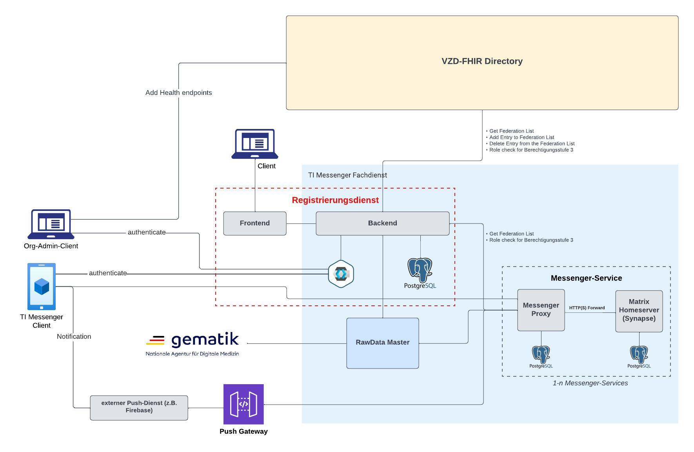

# TIM Referenzimplementierung - Registrierungsservice
This project contains the `TIM reference implementation` of a `Fachdienst`. It is based on the following technologies:
* `Maven`
* `Spring Boot`
* `PostgreSQL`
* `Angular (Frontend)`
* `TypeScript (Frontend)`

## Usage

1. Update your `hosts` file with the following entry: 
    
    `127.0.0.1 host.docker.internal` 
   
   1. Linux and Mac: `/etc/hosts` 
   2. Windows: `C:\Windows\System32\Drivers\etc\hosts`

> _**HINT**_ <br/>
> _In the local environment there is no Kubernetes operator. Calls to the Kubernetes operator are prevented by conditional statements in local environment.
In the local environment one can create `messenger service` instances in the registration service frontend. 
Please note that these are not connected to the `messenger service` instances started with`docker compose` in the `Messenger Proxy` project._ 

2. If you choose to use `maven-wrapper` please make sure that it uses JDK 17 and not above. You can verify this with following command:
```bash
$  ./mvnw --version
Maven home: [...]
Java version: 17, [...] 
Default locale: de_DE, platform encoding: UTF-8
OS name: [...]
```

### Run everything with Docker Compose

You can bring up the Backend, Frontend, Keycloak (with database) and database with `docker compose`. Please note that the Spring Boot profile [local-docker](rd-backend/src/main/resources/application-local-docker.yml) is then utilized by default.

1. Create a docker network with the name `timref-network` if it not already exists
    ```shell
    $ docker network create timref-network
    ```

2. The backend should be built at least once because the build artifact is used to create the docker image. This can be done like so:
    ```shell
    $ ./mvnw -f rd-backend/pom.xml clean package
    ```

3. Run
    ```shell
    $ docker compose up --build
    ```

### Application
1. Navigate to `http://localhost:4200/` where the frontend is running on.

## Development
### The Spring boot backend
As an alternative (especially for debugging purposes) you can run the backend natively via IntelliJ [Run Configuration called Backend](.run/Backend.run.xml). 
See also the [IntelliJ Documentation](https://www.jetbrains.com/help/idea/run-debug-configuration.html) how to import the run configuration.
This one utilizes the Spring Boot profile [local](rd-backend/src/main/resources/application-local.yml) by default.

> _**ATTENTION**_ <br/>
> _Please note that the backend run from docker compose must be disabled in that case to prevent port conflicts._

### Swagger UI
Open http://localhost:8080/backend/swagger-ui/index.html to see the API definitions

### The Angular frontend with npm
* Development server
   * Start the angular application by running 
        ```shell
        $ cd rd-frontend
        $ ng serve
        ``` 
   * Navigate to `http://localhost:4200/`. The application will automatically reload if you change any of the source files.
* Build
   * Run `ng build` to build the project. The build artifacts will be stored in the `dist/` directory.
* Running unit tests
   * Run `ng test` to execute the unit tests via [Karma](https://karma-runner.github.io).
* Further help
   * To get more help on the Angular CLI use `ng help` or go check out the [Angular CLI Overview and Command Reference](https://angular.io/cli) page.

> _**HINT**_ <br/>
> _As an alternative (especially for debugging purposes) you can run the Frontend via [Run Configuration called Frontend](.run/Frontend.run.xml). See also the [IntelliJ Documentation](https://www.jetbrains.com/help/idea/run-debug-configuration.html) how to import the run configuration. This enables you to put breakpoints into the frontend code (TypeScript) for better debugging._

### Dependencies

1. For a list of dependencies for the backend see here [rd-backend/pom.xml](rd-backend/pom.xml). The dependencies are listed inside the `<dependencies>` tag. 
    Alternatively you can use the command (`Maven` required):
    ```shell
    $ ./mvnw -f rd-backend/pom.xml dependency:tree
    ``` 
2. For a list of dependencies for the frontend see here [rd-frontend/package.json](rd-frontend/package.json).
The dependencies are listed inside the `dependencies` and the `devDependencies` field.
Alternatively you can use the command (`npm` required):
    ```shell
    $ cd rd-frontend
    $ npm ls --all
    ``` 

### Standard Ports

| Port Number | Port Number Docker Internal | Description                     | Credentials                            |
|------------|-----------------------------|---------------------------------|----------------------------------------|
| 8080       | 8080                        | Application Backend          |                                        |
| 8081       | 8081                        | Application Backend Healthcheck |                                        |
| 4200       | 80                          | Application Frontend        | test:test                              |
| 5432       | 5432                        | Application DB              | registration-service:password          |
| 8180       | 8080                        | Keycloak                    | admin:admin                            |
| 5435       | 5435                        | Keycloak DB                 | registration-service-keycloak:password |

### Probes
The health and readiness of this service can be obtained at the following endpoints:

- `GET :8081/actuator/health/liveness`
- `GET :8081/actuator/health/readiness`

`liveness` includes health states of the following components:

- `web-server`

`readiness` includes health states of the following components:

- `database`
- `keycloak`

## Keycloak

The keycloak is running under `http://host.docker.internal:8180`.

To be able to send emails from local keycloak the SMTP Server configuration needs to be set in [keycloak/import/realm-registrationservice.json](keycloak/import/realm-registrationservice.json) property `smtpServer`


## Connect to test VZD FHIR directory 

1. To connect to the test vzd you need to get a client id and a client secret. You can get it from the Arvato SE.

2. 
   1. Option 1: Copy [application-local-docker-with-vzd-test.yml.template](rd-backend/src/main/resources/application-local-docker-with-vzd-test.yml.template) to `application-local-docker-with-vzd-test.yml` if you are using docker compose to run the backend. 
   2. Option 2: [application-local-with-vzd-test.yml.template](rd-backend/src/main/resources/application-local-with-vzd-test.yml.template) to `application-local-with-vzd-test.yml` if you are running your backend locally (with run configuration).

3. Edit the properties in the copied file [application-local-docker-with-vzd-test.yml](rd-backend/src/main/resources/application-local-docker-with-vzd-test.yml) or [application-local-with-vzd-test.yml](rd-backend/src/main/resources/application-local-with-vzd-test.yml) in the section `vzd`:

   | Key          | Old Value              | New Value            |
   |--------------|------------------------|----------------------|
   | clientId     | fillInYourClientId     | {your client id}     |
   | clientSecret | fillInYourClientSecret | {your client secret} |

4. Change the profile:
   1. Option 1. When you run the backend with `docker compose up`, change the line in the [docker-compose.yml](docker-compose.yml) `SPRING_PROFILES_ACTIVE: local-docker` to `SPRING_PROFILES_ACTIVE: local-docker-with-vzd-test`. 
   2. Option 2. When you run the backend locally use the predefined [Run Configuration Backend - local-with-zd-test](.run/Backend%20-%20local-with-vzd-test.run.xml).

## Tests with Maven

1. Generally, the tests can be run with the following command. There are unit and integrations test executed.
```shell
$ ./mvnw -f rd-backend/pom.xml test
```
2. The [Federation List Test](rd-backend/src/test/kotlin/de/akquinet/timref/registrationservice/integrationTests/api/messengerService/FederationListTest.kt) requires the registration service to connect with the actual VZD-Server instead of the mock server. In order to run this test, you will have to use [application-integration-tests-with-vzd-test.yml](rd-backend/src/test/resources/application-integration-tests-with-vzd-test.yml). In this file, you have to replace the **clientID** and **clientSecret** in the section `vzd`

## License reports
License reports can be created at any time for the following modules:

* rd-backend
* rd-frontend

### rd-backend
In order to create a license report for the `rd-backend` module simply run the following commands inside the project root directory. These commands are tested with `zsh` but should apply in `bash` also:

```bash
$ ./mvnw license:third-party-report -f rd-backend/pom.xml
```

License reports can then be found at `$PROJECT_DIR/target/reports/third-party-report.html`.

### rd-frontend
In order to create a license report for the `rd-frontend` module simply run the following commands inside the project root directory. These commands are tested with `zsh` but should apply in `bash` also:

```bash
$ ./mvnw -f rd-frontend/pom.xml site -P license
```

License reports can then be found at `$PROJECT_DIR/target/reports/third-party-report-npm.txt`.
Please note that the directories css and images and their contents actually belong to the license report. However, they are only used for styling the `HTML` page and as such are not required to view the report.

## Architecture Overview

### Ways of communication
1. Frontend needs to be able to communicate with the backend.
2. Requests to homeserver Userinfo API ( "/_matrix/federation/v1/openid/userinfo" ) for  contact-management OpenID token checks
3. Requests toward the rawdata gathering service (`rawdata master`)
4. Connection to Keycloak
5. Requests towards the Kubernetes operator in non-local environments
6. Requests towards the Grafana Loki in non-local environments for log downloads
7. requests towards vzd




